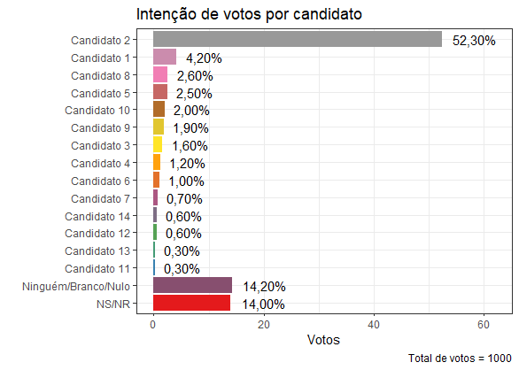
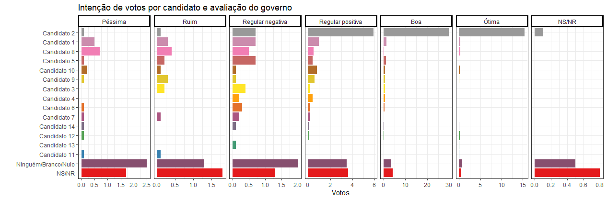

Intenção de voto  - Quaest
================

O presente trabalho visa apresentar uma função para gerar tabelas de contigência de perfil por voto e gráficos de intenção de voto. 

O arquivo "Script_Quaest.R" contém o código utilizado para a análise.

# Pré-processamento
Uma análise inicial é realizada a fim de se verificar a existência de dados faltantes e a consistência dos dados.

Não há dados faltantes.

A análise não evidenciou nenhum problema de formatação. 

A variável idde foi categorizada em faixas etárias.

# Tabela de Contigência
A função `tab_contgn` permite apresentar dados de intenção de voto por perfil demográfico. Os argumentos possíveis da função são:

* *data:* Banco de dados a ser analisado. O default é o banco fornecido.

* *.voto:* Variável que conterá o candidato escolhido.

* *.perfil:* Variável que fará o cruzamento com voto. Pode ser um vetor com múltiplas variáveis.

* *showFTotal:* Variável lógica que indicará se o total de votos será exibido ou não. É sempre verdadeira para "type ='abs+prop'".

* *showPropTotal:* Variável lógica que indicará se o total proporcional (em %) de votos será exibido ou não. É sempre verdaeira para "type ='abs+prop'".

* *type:* Tipo de tabela gerada. Valores possíveis: "abs" - valores totais, "prop" - valores proporcionais ou "abs+prop" - valores totais e proporcionais.

* *digits:* Dígitos dos valores proporcionais. Se nulo, exibirá o valor serm formatação.

* *margin:* Funciona somente se "type" é "abs" ou "abs+prop". Indica se os valores proporcionais devem ser calculados por linha ou coluna. Isso não afeta o total proporcional, que sempre é calculado pela proporção total do candidato.

* *order:* Ordena a tabela pela porcentagem de votação do total.

* *reduce:* Para o caso de mais de uma variável escohida como perfil, mescla os bancos, retornando um data.frame ao invés de uma lista.

## Exemplo de uso
tab_contgn(.perfil = "sexo")

|Voto1                |  Feminino   |  Masculino  |   Total    |
|:------------------- | -----------:| -----------:| ----------:|
|Candidato 2          |295 (54,13%) |228 (50,11%) |523 (52,30%)|
|Ninguém/Branco/Nulo  |72 (13,21%)  |70 (15,38%)  |142 (14,20%)|
|NS/NR                |83 (15,23%)  |57 (12,53%)  |140 (14,00%)|
|Candidato 1          |11 (2,02%)   |31 (6,81%)   |42 (4,20%)  |  
|Candidato 8          |14 (2,57%)   |12 (2,64%)   |26 (2,60%)  |  
|Candidato 5          |14 (2,57%)   |11 (2,42%)   |25 (2,50%)  |  
|Candidato 10         |14 (2,57%)   |6 (1,32%)    |20 (2,00%)  |  
|Candidato 9          |7 (1,28%)    |12 (2,64%)   |19 (1,90%)  |  
|Candidato 3          |9 (1,65%)    |7 (1,54%)    |16 (1,60%)  |  
|Candidato 4          |4 (0,73%)    |8 (1,76%)    |12 (1,20%)  |  
|Candidato 6          |7 (1,28%)    |3 (0,66%)    |10 (1,00%)  |  
|Candidato 7          |3 (0,55%)    |4 (0,88%)    |7 (0,70%)   |   
|Candidato 12         |3 (0,55%)    |3 (0,66%)    |6 (0,60%)   |   
|Candidato 14         |6 (1,10%)    |0 (0,00%)    |6 (0,60%)   |   
|Candidato 11         |1 (0,18%)    |2 (0,44%)    |3 (0,30%)   |   
|Candidato 13         |2 (0,37%)    |1 (0,22%)    |3 (0,30%)   |   

Pela análise da tabela, podemos perceber que o Candidato 2 tem mais de metade do voto do público feminino e o mesmo se repete com o público masculino.

# Gráficos

O gráfico acima mostra que o Candidato 2 tem mais da metade das intenções de voto, aparecendo isolado na liderança. Cada um dos outros 13 candidatos não chegam nem a 5% da preferência dos votos, e mesmo que algum deles converta todos os votos de quem não sabe/não respondeu para si, não seria suficiente para chegar perto das intenções de voto do Candidato 2.

O gráfico acima mostra que a maioria das pessoas que avaliam de forma regular positiva, boa ou ótima o governo votam no Candidato 2. Os que avaliam o governo de forma péssima, ruim ou regular negativa tendem a votar nos Candidatos 1, 8 e 5. Há também uma tendência de pessoas que avaliam o governo de forma regular negativa a votar o candidato 2.

É perceptível também que os que avaliam o governo de forma boa ou ótima parecem mais decididos no voto, que no caso é para o Candidato 2, visto que a porcentagem dos que declararam voto em ninguém/branco/nulo ou não sabe/não respondeu é bem baixa em comparação aos outros níveis inferiores de avaliação.